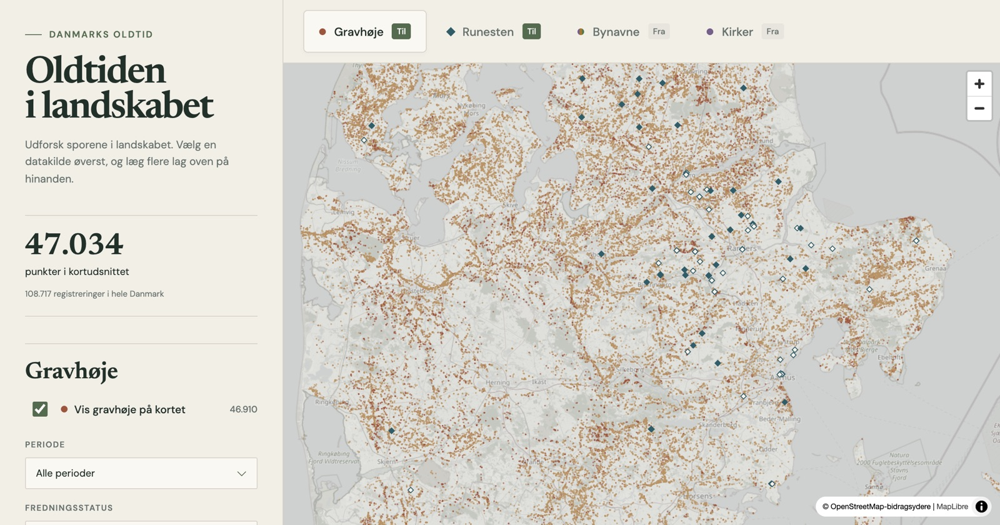

# Oldtidskort — kort over gravhøje, runesten og oldtidsminder i Danmark

**Et åbent, interaktivt kort over mere end 100.000 registrerede gravhøje, andre gravminder, runesten, kirker og daterede bynavne i Danmark.**

[Åbn kortet →](https://kasperjunge.github.io/oldtidskort/)

[](https://kasperjunge.github.io/oldtidskort/)

Oldtidskort gør Slots- og Kulturstyrelsens landsdækkende data fra Fund og
Fortidsminder nemme at udforske. Zoom ind på dit lokalområde, filtrér efter
periode eller fredningsstatus, og klik på et punkt for at gå videre til den
officielle registrering.

Kortet viser blandt andet rundhøje, langhøje, dysser, jættestuer,
skibssætninger og gravpladser. Både fredede og ikke-fredede registreringer er
med. Det er et historisk register — ikke en garanti for, at et gravminde stadig
er synligt eller tilgængeligt i landskabet.

Kortet starter med kun gravhøje slået til. Topbaren har faner for gravhøje,
runesten, bynavne og kirker. Hver fane har sin egen til/fra-knap og egne
filtre, inklusive periode. Faneskift bevarer aktive lag og deres filtre. Det gør det muligt at holde lagene op
mod hinanden — for eksempel `-lev`-byernes jernaldernavne mod bronzealderens
gravhøje, eller `-torp`-navnenes udflytterbebyggelser mod runestenene.

## Prøv det

Den nemmeste vej er den offentlige udgave på GitHub Pages:

**https://kasperjunge.github.io/oldtidskort/**

Vil du køre projektet lokalt eller hente de nyeste kildedata:

```bash
git clone https://github.com/kasperjunge/oldtidskort.git
cd oldtidskort
uv sync --extra dev
uv run oldtidskort map
```

Kortet åbner på `http://127.0.0.1:8000/web/`. Første kørsel henter data fra
Fund og Fortidsminder; derefter genbruges den lokale cache. Hent på ny med:

```bash
uv run oldtidskort map --refresh
```

## Hvad ligger der i projektet?

```text
src/oldtidskort/
  core/                 fælles datamodel, geometri og output
  sources/              adaptere til de eksterne datakilder
  pipeline.py           hent → normalisér → validér → skriv
  cli.py                kommandolinjen
web/                    selve kortoplevelsen
scripts/
  build_static_site.py  lokalt build til GitHub Pages
docs/                   kilder og datamodel
tests/                  parser- og pipeline-tests
```

Pipeline-output gemmes som GeoJSON til kortbrug og Parquet til analyse i
`data/processed/`. Rå og genererede data bliver ikke committed på `main`.
`data/curated/` indeholder derimod de håndkuraterede datasæt, der er en del af
kildekoden: runestensresearchen og bynavnenes endelsesklassifikation.

## Byg den statiske GitHub Pages-udgave

Pages-sitet bygges bevidst lokalt for nu — der er ingen GitHub Action. Det
kompakte build indeholder de samme kortpunkter, men kun de felter browseren
bruger.

```bash
uv run oldtidskort build fund_og_fortidsminder
uv run oldtidskort build bynavne_osm
uv run oldtidskort build kirker_osm
uv run python scripts/build_runestone_research.py
uv run python scripts/build_static_site.py
uv run python -m http.server 8000 --directory .pages-dist
```

Åbn `http://127.0.0.1:8000`. `.pages-dist/` er det færdige statiske site, som
publiceres fra repoets `gh-pages`-branch. En automatiseret build/deploy kan
tilføjes senere uden at ændre selve sitet.

Maintainers kan bygge og pushe `gh-pages` lokalt i én arbejdsgang:

```bash
./scripts/deploy_pages.sh --dry-run
./scripts/deploy_pages.sh
```

En dry-run kører preflight, tests, data-refresh, build og validering uden at
pushe. Den egentlige deployment overskriver kun den genererede `gh-pages`-branch;
`main` og lokale kildedata på `main` røres ikke. Scriptet genhenter begge
publicerede datakilder, kontrollerer at buildet indeholder både gravminder og
runesten og verificerer til sidst datafilen på det offentlige site.

## Daterede bynavne

Bynavnelaget henter danske bebyggelser fra OpenStreetMap og daterer dem efter
navneendelsen ud fra det kuraterede datasæt i
`data/curated/placename_suffixes/`. `-lev`, `-inge` og `-um` hører til ældre
jernalder, `-by` og `-torp/-rup` til vikingetiden, `-rød` og `-tved` til
middelalderens rydningskolonisation.

Endelsen daterer **navnetypen, ikke bebyggelsen**: en landsby kan være ældre end
sit navn, og enkelte navne er sene efterligninger af et gammelt mønster. Hver
endelse har derfor en angivet sikkerhed, som kan filtreres på i kortet. Læs
datasættets README før brug.

## Flere datasæt

Datapipelinen har også en adapter til kirker fra OpenStreetMap. Byg alle lag
samt et samlet datasæt med:

```bash
uv run oldtidskort build all
```

Se [datakilder og kendte faldgruber](docs/kilder.md) og den
[fælles datamodel](docs/datamodel.md) for detaljerne.

## Dokumenteret runestensresearch

Det genbrugelige researchdatasæt i `data/curated/runestones/` skelner mellem
oprindeligt opstillingssted, fundsted, nuværende placering og endnu
uklassificerede registerpunkter. Hvert sted har metode, usikkerhed, begrundelse,
kildeudsagn og reviewstatus. Se datasættets README før brug; importerede rækker
er ikke det samme som individuelt fagligt godkendte rækker.

## Udvikling

```bash
uv run pytest
uv run ruff check .
```

Bidrag er velkomne — især forbedringer af typeudvælgelsen, datakvalitet,
tilgængelighed og kortoplevelsen.
[Åbn et issue](https://github.com/kasperjunge/oldtidskort/issues/new) med en
fejl, et ønske eller en idé — også gerne før større ændringer. Du kan også fange
mig på [LinkedIn](https://www.linkedin.com/in/kasper-juunge/).

## Data og kreditering

Gravhøjsdata kommer fra
[Fund og Fortidsminder](https://www.kulturarv.dk/fundogfortidsminder/) hos
Slots- og Kulturstyrelsen. Runestensresearchen bygger på Wikidata (CC0).
Bynavne og baggrundskort er © OpenStreetMap-bidragsydere (ODbL).
Endelsesdateringen refererer dansk navneforskning; se
`data/curated/placename_suffixes/sources.csv`.
Projektets kildekode er udgivet under MIT-licensen; kildedata følger deres egne
vilkår og er ikke omfattet af MIT.
